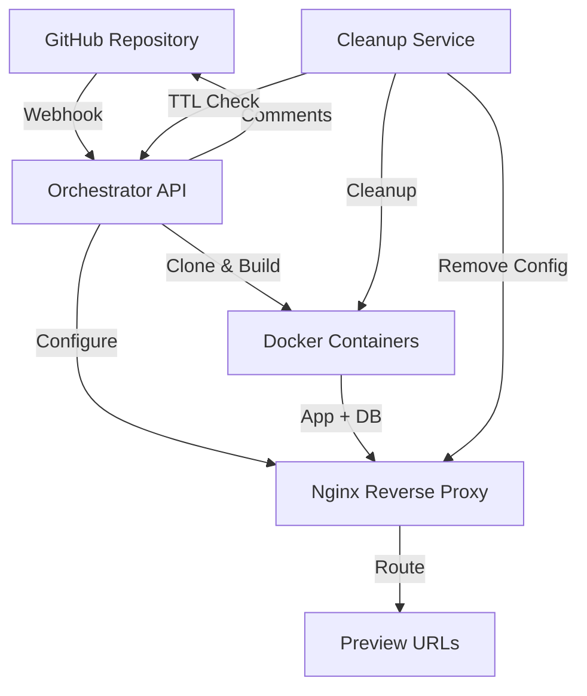

# Architecture Documentation

## System Overview

Preview-deployer is a multi-component system that automatically creates isolated preview environments for backend applications when GitHub PRs are opened.

## Architecture Diagram



## Components

### 1. Terraform

**Purpose**: Infrastructure as Code for Digital Ocean provisioning

**Responsibilities**:

- Create Digital Ocean droplet
- Configure firewall rules
- Allocate reserved IP
- Set up SSH access

**Key Files**:

- `terraform/main.tf`: Resource definitions
- `terraform/variables.tf`: Input variables
- `terraform/outputs.tf`: Output values

### 2. Ansible

**Purpose**: Server configuration and service deployment

**Responsibilities**:

- Install Docker and Docker Compose
- Install and configure nginx
- Deploy orchestrator service
- Set up systemd services
- Configure log rotation

**Roles**:

- **docker**: Docker installation and configuration
- **nginx**: Nginx installation and preview config structure
- **orchestrator**: Orchestrator service deployment

### 3. Orchestrator Service

**Purpose**: Core service handling webhooks and managing deployments

**Responsibilities**:

- Receive and verify GitHub webhooks
- Clone repositories
- Detect framework (NestJS/Go)
- Generate Docker Compose files
- Build and start containers
- Configure nginx routing
- Post comments to GitHub PRs
- Cleanup stale deployments

**Key Modules**:

- **webhook-handler.ts**: Webhook processing and routing
- **docker-manager.ts**: Docker operations
- **nginx-manager.ts**: Nginx configuration management
- **github-client.ts**: GitHub API interactions
- **cleanup-service.ts**: Scheduled cleanup tasks
- **deployment-tracker.ts**: Deployment state management

### 4. CLI Tool

**Purpose**: User-facing interface for setup and management

**Responsibilities**:

- Initialize configuration
- Run Terraform and Ansible
- Create GitHub webhooks
- Check deployment status
- Destroy infrastructure

**Commands**:

- `init`: Create configuration file
- `setup`: Deploy infrastructure
- `status`: Check system status
- `destroy`: Teardown infrastructure

## Data Flow

### Deployment Flow

```
1. PR Opened → GitHub Webhook → Orchestrator
2. Orchestrator validates repository and webhook signature
3. Orchestrator clones repository and checks out PR branch
4. Framework detection (NestJS/Go)
5. Generate Docker Compose file from template
6. Allocate ports (app: 8000 + PR#, db: 9000 + PR#)
7. Build and start containers
8. Wait for health check
9. Generate nginx config
10. Reload nginx
11. Post comment to PR with preview URL
12. Save deployment info to tracking store
```

### Update Flow

```
1. PR Updated → GitHub Webhook → Orchestrator
2. Pull latest changes from repository
3. Rebuild containers
4. Wait for health check
5. Update PR comment with new preview URL
```

### Cleanup Flow

```
1. PR Closed OR TTL Expired → Cleanup Service
2. Stop Docker containers
3. Remove Docker volumes
4. Delete nginx config
5. Reload nginx
6. Remove deployment from tracking store
7. Release ports
```

## Port Allocation Strategy

- **Global pool**: App ports start at 8000, DB ports at 9000. Each new deployment gets the next free app port and next free db port (keyed by deployment id).
- Allows many deployments across multiple repos without collision.

## Routing Strategy

**Path-based routing**: `/{PROJECT_SLUG}/pr-{PR_NUMBER}/`

- **Project slug**: From repo owner/name (e.g. `myorg-myapp`). Avoids collisions when multiple repos have the same PR number.
- Example: `http://SERVER_IP/myorg-myapp/pr-12/`
- nginx proxies to `http://localhost:{APP_PORT}/`
- Path prefix is stripped in proxy configuration

**Future**: Subdomain support (`pr-123.server.com`) requires DNS configuration.

## Security

### Webhook Security

- **Signature Verification**: HMAC SHA256 verification of webhook payloads
- **Repository Whitelist**: Only allowed repositories can trigger deployments
- **Input Sanitization**: PR numbers and branch names are validated

### Container Security

- **Resource Limits**: CPU and memory limits per container
- **Non-root Users**: Containers run as non-root users
- **Network Isolation**: Containers are isolated on Docker network
- **Health Checks**: Containers must pass health checks before being routed

### Infrastructure Security

- **SSH Key Authentication**: Only SSH key access to droplet
- **Firewall Rules**: Only necessary ports open (22, 80, 443)
- **Internal API**: Orchestrator API not exposed publicly (internal port 3000)
- **Keychain Storage**: Sensitive tokens stored in OS keychain

## Deployment Tracking

Deployments are tracked in a JSON file (`/opt/preview-deployer/deployments.json`). Keys are **deployment ids** (`{projectSlug}-{prNumber}`):

```json
{
  "deployments": {
    "my-org-my-app-12": {
      "prNumber": 12,
      "repoName": "my-app",
      "repoOwner": "my-org",
      "projectSlug": "my-org-my-app",
      "deploymentId": "my-org-my-app-12",
      "branch": "feature-branch",
      "commitSha": "abc123...",
      "framework": "nestjs",
      "dbType": "postgres",
      "appPort": 8000,
      "dbPort": 9000,
      "status": "running",
      "createdAt": "2026-01-29T10:00:00Z",
      "updatedAt": "2026-01-29T10:00:00Z",
      "url": "http://SERVER_IP/my-org-my-app/pr-12/",
      "commentId": 456789
    }
  },
  "portAllocations": {
    "my-org-my-app-12": {
      "appPort": 8000,
      "dbPort": 9000
    }
  }
}
```

## Scaling Considerations

### Current Limitations

- **Single Server**: All previews run on one droplet
- **Resource Limits**: Limited by droplet size
- **Port Range**: Maximum ~56k PRs per repo

### Future Scaling Options

1. **Horizontal Scaling**: Multiple droplets with load balancer
2. **Kubernetes**: Container orchestration for better resource management
3. **Subdomain Routing**: DNS-based routing instead of path-based
4. **Database Pooling**: Shared database instances for cost savings
5. **Caching**: Docker image caching for faster builds

## Monitoring

### Current Monitoring

- **Logs**: Orchestrator logs to `/opt/preview-deployer/logs/`
- **Systemd**: Service status via `systemctl status`
- **Health Endpoint**: `/health` endpoint for basic health checks

### Future Monitoring

- **Metrics**: Prometheus metrics export
- **Alerting**: Alertmanager integration
- **Dashboard**: Grafana dashboard for visualization
- **Tracing**: Distributed tracing for request flows

## Error Handling

### Retry Logic

- **Transient Failures**: Max 3 retries with exponential backoff
- **Health Checks**: 60-second timeout with 5-second intervals
- **GitHub API**: Automatic retry on rate limits

### Error Reporting

- **GitHub Comments**: Failure comments posted to PRs
- **Logging**: Comprehensive error logging with context
- **Status Tracking**: Deployment status tracked (building/running/failed)

## Cost Management

### Resource Limits

- **Default TTL**: 7 days
- **Max Concurrent**: 10 previews (configurable)
- **Container Limits**: 512MB RAM, 0.5 CPU per container

### Cost Optimization

- **Auto Cleanup**: Stale previews cleaned automatically
- **Resource Limits**: Prevent resource exhaustion
- **Efficient Builds**: Docker layer caching
- **Small Droplets**: Use smallest droplet size that fits needs
