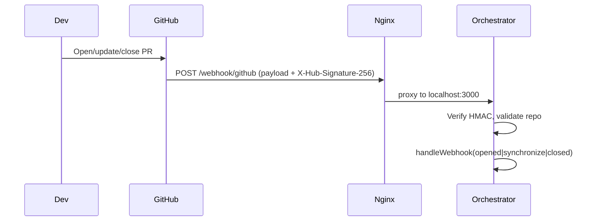
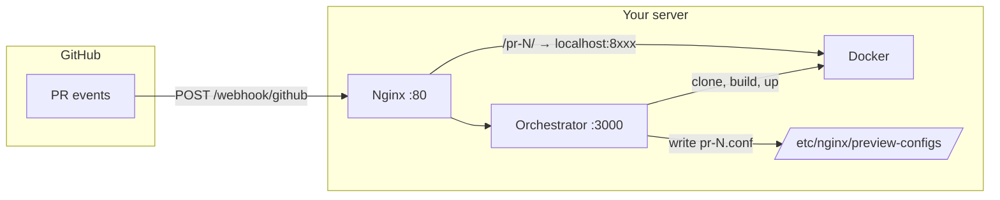
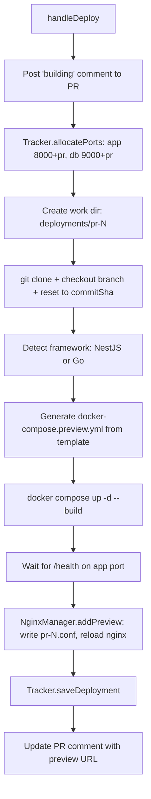
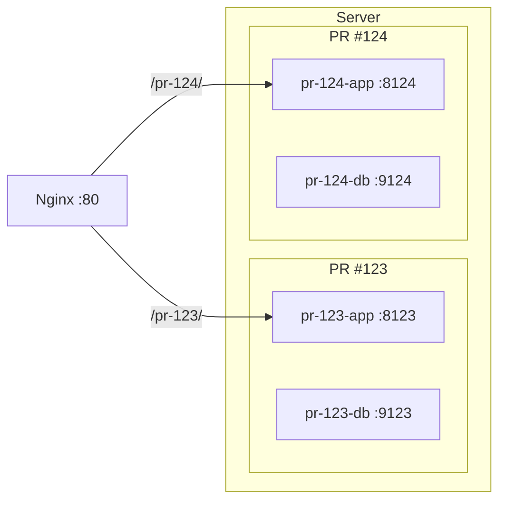

# How the Orchestrator Works

This doc explains how the orchestrator receives GitHub events, how containers are spun up per preview, and how the pieces connect. Diagrams use Mermaid.

---

## 1. Webhooks: GitHub Pushes (No Polling)

**The orchestrator does not poll GitHub.** GitHub **pushes** events to the orchestrator over HTTP when PR-related events happen.

```
GitHub (on PR open/update/close)  →  HTTP POST  →  Your server  →  Orchestrator
```

- **No polling** → no polling interval and no rate-limit risk from repeated API calls for “check for new PRs.”
- **Rate limits** that do apply are the normal GitHub API limits when the orchestrator *calls back* GitHub (e.g. post/update PR comments, list webhooks). Those are standard REST limits; webhook *delivery* is pushed by GitHub and doesn’t consume polling-style quota.

### How the webhook URL gets on GitHub (you didn’t type it in)

You don’t manually add the webhook in GitHub’s UI. The **CLI creates it via the GitHub API** when you run:

```bash
preview setup
```

During setup, after Terraform and Ansible run, the CLI:

1. Reads your config (including `github.repositories` and `github.webhook_secret`).
2. For each repo, calls GitHub’s [Create a webhook](https://docs.github.com/en/rest/repos/webhooks#create-a-repository-webhook) API.
3. Sets the webhook URL to `http://<server-ip>/webhook/github` and the secret to your configured `webhook_secret`.
4. Subscribes to the `pull_request` event.

So the “webhook link” is registered programmatically; you only provided the token (with `admin:repo_hook`) and the repo list during `preview init`.

### End-to-end webhook path



- **Nginx** listens on port 80 and proxies `/webhook/github` to the orchestrator (e.g. `localhost:3000`).
- **Orchestrator** (Express) serves `POST /webhook/github`, verifies the signature with `GITHUB_WEBHOOK_SECRET`, then calls `WebhookHandler.handleWebhook(payload)`.

---

## 2. High-level architecture



- **Inbound:** GitHub → Nginx (80) → Orchestrator (3000).
- **Orchestrator** drives clone/build/run via Docker and writes per-PR nginx configs.
- **Traffic to previews:** Browser → Nginx `/pr-{number}/` → proxy to container port (8000 + prNumber).

---

## 3. Spinning up containers per preview

When the webhook payload has `action: opened` or `reopened`, the orchestrator runs a **deploy** flow. When `action: synchronize`, it runs an **update** flow (same host, rebuild/restart). Containers are **one set per PR** (app + DB), not shared.

### Deploy flow (new PR)



- **Ports:** App = `8000 + prNumber`, DB = `9000 + prNumber` (see [implementation-plan.md](implementation-plan.md)).
- **Work dir:** `/opt/preview-deployments/pr-<number>/` (or `DEPLOYMENTS_DIR`); clone lives there, and `docker compose` runs in that directory.
- **Compose file:** Generated from Handlebars templates (`docker-compose.nestjs.yml.hbs` or `docker-compose.go.yml.hbs`) with `prNumber`, `appPort`, `dbPort`.
- **Health:** Orchestrator polls `http://localhost:<appPort>/health` (e.g. every 5s, up to 60s) before marking the preview as up and updating the PR comment.

### Container layout per PR



- Each PR gets its own app and DB containers and ports; no sharing between PRs.
- Nginx includes configs from `/etc/nginx/preview-configs/`; each file defines `location /pr-<number>/` and `proxy_pass` to the corresponding app port.

### Update and cleanup

- **Update (synchronize):** Same `pr-<number>` work dir; `git fetch` + `git reset --hard <commitSha>`, then `docker compose up -d --build`, health check, update deployment record and PR comment.
- **Cleanup (closed or TTL):** `docker compose down -v`, remove work dir, remove nginx config, reload nginx, `tracker.deleteDeployment` and release ports.

---

## 4. Where it lives in the repo

| Concern | Where |
|--------|--------|
| Webhook HTTP endpoint | `orchestrator/src/index.ts` → `POST /webhook/github` |
| Signature check + routing by action | `orchestrator/src/webhook-handler.ts` |
| Clone, build, compose, health | `orchestrator/src/docker-manager.ts` |
| Per-PR nginx config + reload | `orchestrator/src/nginx-manager.ts` |
| Creating the webhook on GitHub | `cli/src/commands/setup.ts` + `cli/src/utils/github.ts` |
| Nginx proxy for `/webhook/github` | `ansible/roles/nginx/templates/nginx.conf.j2` (default server: `location /webhook/` → orchestrator port) |
